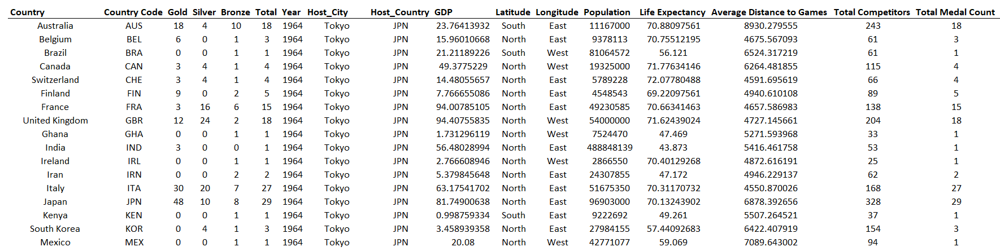
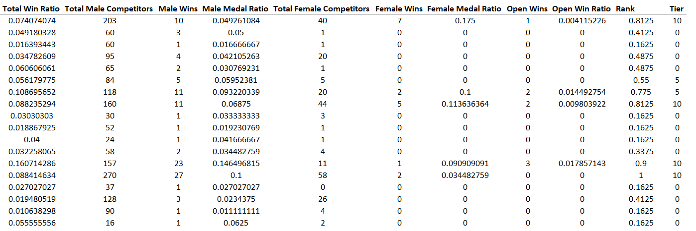
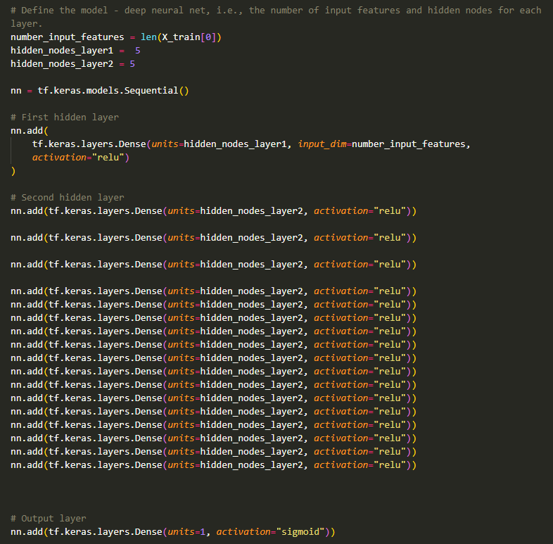
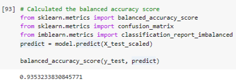
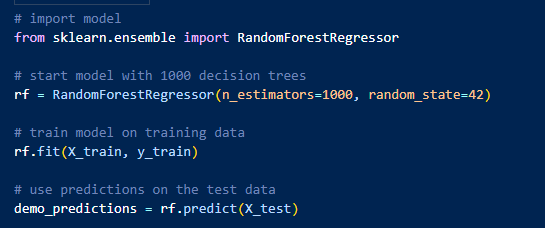
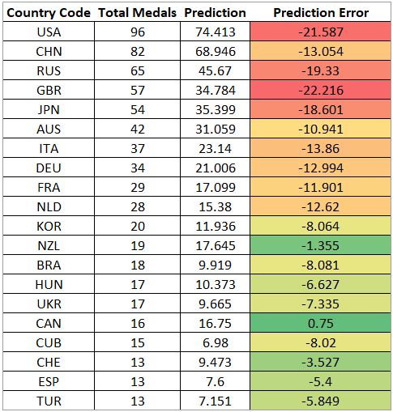

# :1st_place_medal: :2nd_place_medal: :3rd_place_medal: Olympics Analysis :1st_place_medal: :2nd_place_medal: :3rd_place_medal:

## Overview
As more than 50,000 athletes, coaches, trainers, and team members head to the land of the rising sun we wondered, "Can Olympic results be predicted?". We analyzed the history of the Summer Olympics to see how past results might help us predict which country will hear their national anthem the most times this year. 

Along with the results of thousands of events our analysis includes non-traditional data including country GDP, country population, life expectancy, and distance from the competing country's capital city to the location of the games. Do these demographic features make a difference in the success of Olympic athletes?

Using advanced machine learning techniques we answer these questions and more on our quest to tackle Tokyo and stand atop the prediction podium. 

### 🎌 From Tokyo to Tokyo 🎌

Japan is one of just six countries who have hosted the Summer Olympics multiple times since 1900. For our analysis we decided to collect data from the first Summer games in Tokyo in 1964, through the most recent Summer games in Rio de Janeiro, Brazil, in 2016. Our data comprised nearly 22,000 medals won by 141 countries in 335 individual and team events.

Our dataset is broken down by competition data and country data. All data points were collected for each year the Summer Olympics were held.

Competition data includes:
* Event 
* Discipline
* Gender
* Competing Country 
* Competition Year
* Host Country
* Winning Countries
* Medal won (gold, silver, bronze)
* Number of competitors from each country
* Country win ratio
* Gender win ratio by country

Country Data includes:

* GDP
* Population
* Life Expectancy
* Distance from competing country to host country
* Longitude (used to add country seasonality)

The data was collected from the following sources:
* Olympedia.com
* data.worldbank.org
* OECD.org

Data was collected, cleaned, and stored in an AWS database which was subsequently connected to SQL. Data processing was enabled by reading SQL data using sqlalchemy and python. 

Code was developed and tested in various IDEs including Jupyter Notebook, VSCode, and Google Colab.

# The Analysis

Our data provided multiple routes of analysis to determine how economic, demographic, and geographic factors may affect the potential outcomes of Olympic competitions. We analyzed the data with both categorical and projection analyses. 

To provide additional features to our dataset we used the total number of competitors from each country and total number of competitors by gender to calculate the medal-win-ratio for each country overall and by gender. For example, a country which sent 100 competitors and won 10 medals would have an overall win ratio of 10%. We also scaled medal wins by increasing the value of gold medals to 3 and silver medals to 2. Our assumption was that the probability of winning at least one medal improved with the number of gold or silver medals won. Tiers were calculated by percentile ranking each country in each Olympic year based on total medals won. 

### Categorical Analysis
Our categorical analysis attempted to separate countries into high performers, average performers, or poor performers. 

* Top performers were defined as countries in the 90th percentile of the historical medal count for each Olympic year.
* Intermediate performers were defined as countries in the 80th to 30th percentile
* Bottom performers were defined as countries below the 30th percentile

Data from multiple SQL tables were joined to maximize the dataset input for the neural network algorithm.

The classification analysis was performed using a deep neural network model utilizing tensorflow and an easy ensemble AdaBoost as a classification algorithm. Additional hidden layers were added during testing to determine if additional calculations yielded higher accuracy. 

The classification model was analyzed using scikitlearn metrics methods to generate a balanced accuracy score, confusion matric, and classification report from imblearn. 

The balanced accuracy score of the model was 0.94 indicated a successful classification algorithm.

### Prediction Analysis
Predictions were made by training and testing a random forest regression model. The model was built on the RandomForestRegressor method from SciKitLearn.ensemble module. The random forest regressor method was selected because of non-linear relationships between our training features and dependent variable and because our training dataset was susceptible to overfitting. The random forest estimator used sub-samples and averages to improve predictive accuracy and help control for over-fitting.

# The Results

The following results table was created by running our projection model on the 2021 competition data and comparing the results to the actual results of the 2020 Summer games. The countries shown each collected at least 10 medals in the 2020 games. The negative variance for the countries that won the most medals is likely a factor of model selection. Random Forest models do not extrapolate data from the testing set which means if no country in our testing set had ever won more than 80 medals our predictive model would never predict a country would win 90 medals. In 2020 the highest medal count was 96 (USA). Only 2% of our total medal testing data was above 96 which potentially limited the accuracy of predicting countries with higher total medal counts. 

Highlights of our predictions include Canada and New Zealand which were off by less than two medals. Our accuracy did improve as we moved down the list of total medal counts. 

The overall prediction statistics were as follows:
* MAE = 3.31
* MSE = 36
* RMSE = 6.04
* Accuracy = 64.1% 

The average number of medals won in our testing set was 10 so our model did improve on this simple measure of base error. Our largest absolute error was 22 (GBR). 

### Dashboard
Our dashboard was used to digest the complete dataset and answer questions such as: 
* Do countries with larger populations outperform countries with smaller populations?
* How do medal counts compare when grouping countries by GDP? Is there a connection between GDP and athletic success?
* What if we look at medal count by population and GDP on a per capita basis? Would more countries be qualified as top-tier competitors despite having a lower total medal count?
* Are female competitors from certain countries more successful than male competitors?  
* Are there countries who are "specialists" in specific events?

### Unique aspects of our dataset:

Throughout the years many Olympic athletes have unfortunately been disqualified for various reasons. Disqualified athletes must vacate their medals which are then awarded to the competitor with the next highest finish. Instead of removing the disqualified athletes from our dataset, we chose to view these athletes as their own country, "DQ", to see how they compare to the field.   

During the time period we analyzed countries had been destroyed, created, renamed or merged. We cleaned our dataset to combine countries such as the former USSR and Russia and East Germany and West Germany. These countries are represented by Russia and Germany, respectively, in our dataset.

### Communication protocols:
* Team members communicated through Zoom video calls and Slack messaging
* Code and resources were reviewed by team members through screen sharing and GitHub
* Resources and code were individually committed to team member branches and routinely reviewed and merged to main project branch. 

# Links

Presentation: https://docs.google.com/presentation/d/1THhDSyPohawLwrSiDOjxda2NZSpPXUvQ/edit?usp=sharing&ouid=115662815122483026556&rtpof=true&sd=true

Dashboard: https://public.tableau.com/app/profile/h8213/viz/OlympicAug2/OlympicStatisticsbyCountry?publish=yes
